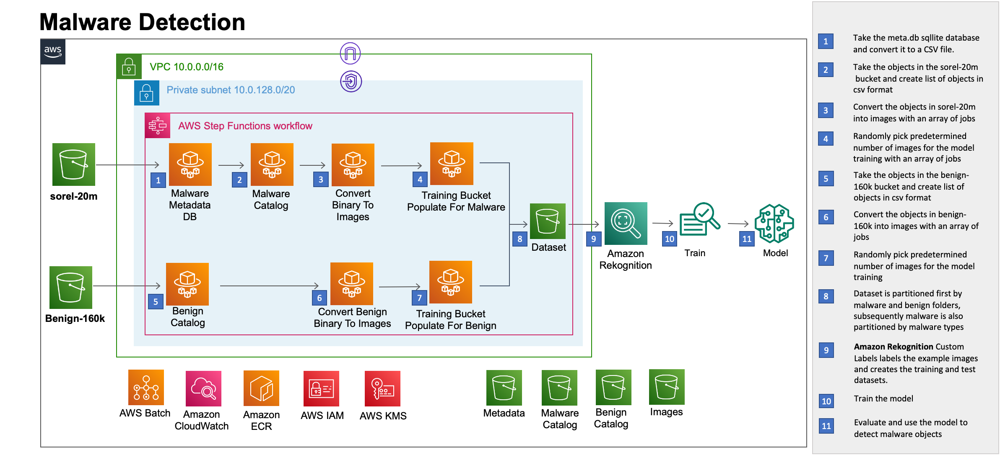
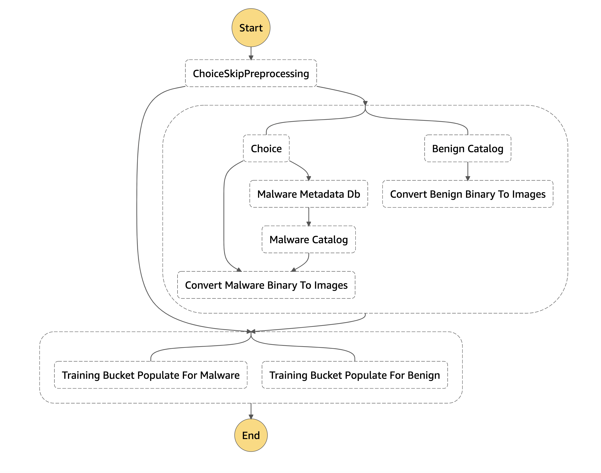

## Overview

According to this [article](https://cybersecurityventures.com/global-ransomware-damage-costs-predicted-to-reach-250-billion-usd-by-2031/) by Cybersecurity Ventures, the damage caused by Ransomware (a form of Malware) increased by 57 times in 2021 compared to 2015 and it is predicted to cost it’s victims $265 billion (USD) annually by 2031. For comparison if we look at the GDP rank by country, at the time when this blog was written, the financial impact from Malware stands in the 50th position. Malware attacks do not spare anyone; They impact from small business to big corporates and even governmental institutions. 

Given the financial impact and not only, several techniques have been developed to aid in the fight against this dangerous threat. The two most common techniques used today by anti-malware products to detect and contain malware are signature and behavioral based. 

Signature-based detection establish a unique identifier about a known malicious object so that the object can be identified in the future.  It may be a unique pattern of code that attaches to a file, or it may be as simple as the hash of a known malware code. If that specific pattern, or signature, is discovered again, the object can be flagged as being infected. Signature detection is fast and requires low compute power but struggles against polymorphic malware types, which continuously change their form to evade detection. 

Behavioral based detection judges the suspicious file based on the behavior of the file. Artefacts that may be taken in consideration from the antimalware product are process interactions, DNS queries and network connections from the object. This technique performs better at detecting polymorphic malware compared to signature based but it has its downsides. In order to assess if an object is malicious, it has to run on the host and generate enough artefacts for the antimalware product to detect it. This blind spot might be enough for the malware to infect the host and spread through the network. 

As we can see, existing techniques are far from being perfect. As a result, research continues with the aim to develop new alternative techniques that will improve our capabilities to combat malware. One novel technique that has emerged in the recent years is Image Based Malware detection. This technique proposes to train a deep-learning network with known malware binaries converted in greyscale images. 

In this post we showcase how to perform Image based Malware detection with Amazon Rekognition custom labels.

### Blogpost URL
[Perform Image based Malware detection with Amazon Rekognition custom labels](link)

### Architecture



### Prerequisites
- [AWS Account](https://console.aws.amazon.com/console/home) 
- [AWS CLI](https://aws.amazon.com/cli/)
- [Python](https://www.python.org/)
- [Docker](https://docs.docker.com/desktop/) 
- [AWS SDK for Python](https://boto3.amazonaws.com/v1/documentation/api/latest/index.html)
- AWS S3 Buckets that contains benign objects and its metadata database.

### Resource Deployment

The cloudformation stack will create the following resources:
- VPC
- Public & Private Subnets 
- Internet Gateway
- Nat Gateway
- Batch Compute Environment
- Batch Queues 
- Batch Job Definitions
- S3 Buckets
- KMS Key
- IAM Roles & Policies
- CloudWatch Logs Group

### Parameters:
- **STACK_NAME** - CloudFormation stack name
- **AWS_REGION** - AWS region where the solution will be deployed
- **AWS_PROFILE** - Named profile that will apply to the AWS CLI command
- **ARTEFACT_S3_BUCKET** - S3 bucket where the infrastructure code will be stored. (*The bucket must be created in the same region where the solution lives*)
- **AWS_ACCOUNT** - AWS Account Id
### Outputs:

- RawDataCatalogJobDefinitionArn              
- ObjectImageConvertionJobDefinitionArn       
- TrainBucketPopulatorJobDefinitionArn        
- ComputeEnvironmentArn                       
- BatchProcessingJobQueueArn                  
- BenignDataCatalogJobDefinitionArn           
- BenignObjectImageConvertionJobDefinitionArn 
- IPAddress                                  
- StackName

### Deployment Commands
Make sure docker agent is running on the machine

All deployments are done using bash scripts, in this case we use the following commands:
    
    bash malware_detection_deployment_scripts/deploy.sh -s '<STACK_NAME>' -b 'malware-detection-<ACCOUNT_ID>-artifacts' -p <AWS_PROFILE> -r "<AWS_REGION>" -a <ACCOUNT_ID> 
 
 Builds and deploys the local artifacts that your AWS CloudFormation template (e.g: cfn_template.yaml) is referencing

### Testing the solution

Make sure the step function looks like the following:



Add/Edit the relavant parameters to the parameters.properties file.
Start the step function by providing the input:

````
    {
        "ByPassPreprocessing":true/false,
        "ByPassMetaDb":true/false

    }
````


### Clean Up

    bash malware_detection_deployment_scripts/destroy.sh -s '<STACK_NAME>' -p <ACCOUNT_ID> -r "<AWS_REGION>"

### Security

See [CONTRIBUTING](CONTRIBUTING.md#security-issue-notifications) for more information.

### License

This library is licensed under the MIT-0 License. See the [LICENSE](LICENSE) file.
